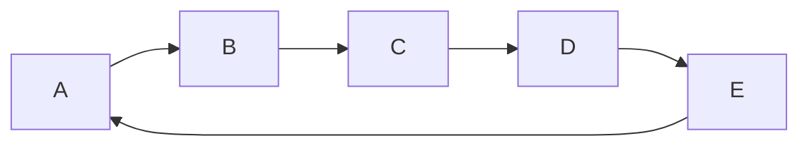

### Hi there 👋
UU
- 🔭 I’m currently working on ...
- 🌱 I’m currently learning ...
- 👯 I’m looking to collaborate on ...
- 🤔 I’m looking for help with ...
- 💬 Ask me about ...
- 📫 How to reach me: ...
- 😄 Pronouns: ...
- ⚡ Fun fact: ...
---
| 🍃 | 🍃 | 🍃 | 🍃 | 🍃 |
|----:|----:|----:|----:|----:|
| 🐶 | 🐱 | 🐭 | 🐹 | 🐰 |
| 🦊 | 🦝 | 🐻 | 🐨 | 🐼 |
| 🐯 | 🦁 | 🐮 | 🐷 | 🐵 | 
| 🐸 | 🐲 | 🦄 | 🐔 | 🐧 |  
---
```geojson
{
  "type": "FeatureCollection",
  "features": [
    {
      "type": "Feature",
      "id": 1,
      "properties": {
        "ID": 0
      },
      "geometry": {
        "type": "Polygon",
        "coordinates": [
          [
              [118.5905, 28.5361],
              [121.1708, 28.5361],
              [121.1708, 30.0756],
              [118.5905, 30.0756],
              [118.5905, 28.5361]
          ]
        ]
      }
    }
  ]
}
```

---
```stl
solid cube_corner
  facet normal 0.0 -1.0 0.0
    outer loop
      vertex 0.0 0.0 0.0
      vertex 1.0 0.0 0.0
      vertex 0.0 0.0 1.0
    endloop
  endfacet
  facet normal 0.0 0.0 -1.0
    outer loop
      vertex 0.0 0.0 0.0
      vertex 0.0 1.0 0.0
      vertex 1.0 0.0 0.0
    endloop
  endfacet
  facet normal -1.0 0.0 0.0
    outer loop
      vertex 0.0 0.0 0.0
      vertex 0.0 0.0 1.0
      vertex 0.0 1.0 0.0
    endloop
  endfacet
  facet normal 0.577 0.577 0.577
    outer loop
      vertex 1.0 0.0 0.0
      vertex 0.0 1.0 0.0
      vertex 0.0 0.0 1.0
    endloop
  endfacet
endsolid
```
